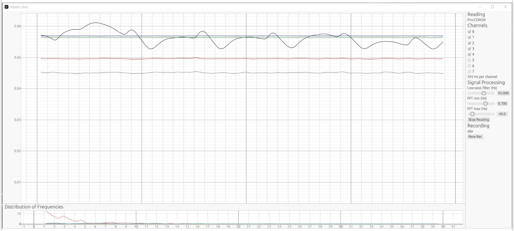

# Ystudio Zero

YLab Edge is a set of firmwares for capturing biosignals with 
easy-to-build micro controller systems. Ystudio is the desktop user interface 
to capture and visualize data from YLab. It currently supports YLab Edge  [Pro](../ylab-edge-pro/), [Go](../ylab-edge-go/) and [Mini](../ylab-edge-go/).

The following features are currently supported:

+   plug-and-play connection to YLab with automatic configuration
+   raw signal view, with adjustable low-pass filter
+   real-time spectrogram using channel-wise FFT
+   one-click recording in user-friendly long format


## Installation 

### For End Users

1. First you need a YLab Edge [Go](https://github.com/schmettow/ylab-edge-go/) or [Pro](https://github.com/schmettow/ylab-edge-pro/).
2. Create a directory on your computer (e.g. MyExperiment), where you want to collect the data.
3. Download [Ystudio Zero for Windows](https://github.com/schmettow/ystudio-zero/raw/main/target/release/ystudio-zero.exe) or [Ystudio Zero for MacOS](https://github.com/schmettow/ystudio-zero/raw/main/target/release/ystudio-zero) and move it (from the Downloads folder) into MyExperiment. Double-click on the program to start.
4. Connect the YLab to the same computer and connect the respective serial port in Ystudio.

It may happen that that your Windows system prevents the app from starting, because it is not certified. In that case: 

1. Open Ystudio in the file explorer
2. Right click on ystudio.exe, choose Properties
3. [Security] Unblocked [X]

Coming soon: downloads for Linux.

### For Developers

1. Install the Rust tool chain: https://rustup.rs/
2. Clone this repository using your favorite editor or the command line: `git clone`
3. Build and run the project: `cargo run`


## Usage

### Getting started

1. Connect your Ylab sensor to your computer
2. Select the correct serial port in the dropdown menu
3. Select the correct YLab version in the dropdown menu
4. Press the `Connect` button
5. Press `Record` to collect data
6. Use the slider to switch between sensory banks
7. Use the check boxes to select channels
8. Use Low Pass filter to reduce noise
9. Use the frequency diagram to analyze biopotential signals

### Post-processing

The main purpose of Ystudio is to view and collect data. Data is recorded in Yld files, which is a long CSV file with one value per row.
This format is easy to read and process for R users. For example, a multi time series plot in R is easily done as follows:

```
library(tidyverse)
Ydata <- read_csv("9457536.yld")
Ydata |>
    ggplot(aes(x = timestamp, color = channel, y = value)) +
    geom_smooth(se = F)
```

## Funding

Ystudio is funded by *WSV Innovation Funds, University of Twente*


# Technical details

+ The project is written in pure Rust
+ The GUI uses Egui, using egui-plot for plotting
+ The serial communication is handled by the serialport crate
+ The architecture is multi-threaded, using std::sync features

## YLab compatibility

Ystudio Zero is compatible with all YLab Edge versions (Pro, Go, Mini). The YLab version can be selected in the GUI.

## Data structure and formats

Data from YLabs currently arrive as YLab Transport Format with 8 channels *YTF8* ("why-the-fate"). This format is designed to be very efficient for high-throughput applications, especially EEG. In Ystudio, the data is converted to YLab Long Data *YLD* ("wild") format, which is more convenient for plotting and storage. It has the following signature:
    
    ```rust
    pub struct Yld {
        pub timestamp: u64,
        pub dev: u8,
        pub channel: u8,
        pub value: f32,
    }
    ```
where *timestamp* is the time-of arrival at the Ystudio application, *dev* is the device number (0..7) and will later be used for setups with more than one YLab. *Channel* is the channel number (0..7) in the sensory, based on the order of the value in the original Ytf8.

While Yld is the prefered format for internal processing and data sharing, *Ytf8* is only used for high-throughput data transfer up the USB port. Ytf8 has the same signature as Yld, except it delivers a vector of eight channels at once. For larger sensor arrays, e.g. a bank of EEG electrodes, this saves a lot of time stamps, which is a very expensive column (8 Bytes). Ytf8 saves quite some bandwidth on the serial line, which is the bottle neck. 

Yld is basically just the long format of Ytf8. It is also independent of how the data arrives.
For the user the long format is more convenient for plotting, storage and tidy data processing. 

## Multi-threaded architecture

The *main thread* initializes channels and other data sharing structures, then starts the other threads and the GUI
The *ylab thread* reads data from the serial port, converts it to YLab long data (YLD). The data is then send to a
History buffer for continuous plotting. Using a channel, the data is also send to the YLD External STorage *Yldest* ("wildest") threat for storage.
The *yldest thread*  receives YLD stream from the Ylab thread and stores it in a csv file.

YLab and Yldest threats are designed as state machines, using enums and match statements. Both have a command channel for control. 
Usually, the GUI thread sends these commands to YLab/Yldest on user event (e.g. button clicked). The YLab/Yldest thread then changes its state (without confirmation).


